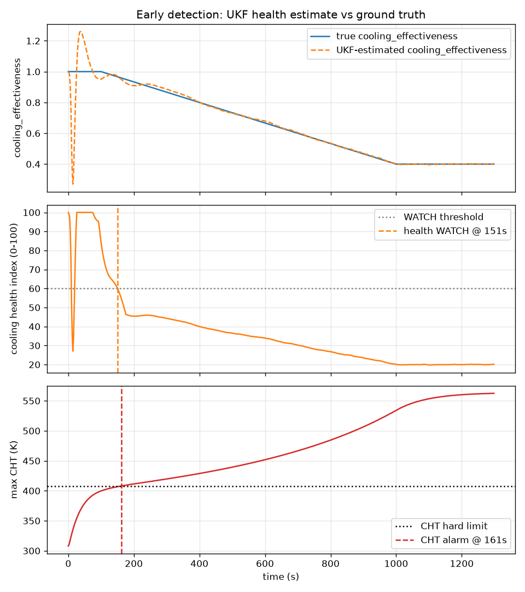

# AeroTwin

AI-enabled real-time digital twin for health monitoring, fault prediction and
mission reliability enhancement of aero piston engines used in MALE UAVs —
built for Smart India Hackathon around a Rotax 914-class turbocharged
4-cylinder boxer (~115 hp).

One virtual engine (`EngineModel` inside `DigitalTwin`) serves **LIVE**
mode (compare model predictions against measured telemetry) and
**SIMULATION** mode (mission what-if / go-no-go), sharing the same physics
and the same estimated health state. See `CLAUDE.md` for the condensed
project charter, `docs/ARCHITECTURE.md` for the 11-layer design, and
`docs/DECISIONS.md` for a running log of every engineering trade-off made
while building this.



*Under a cooling-degradation ramp, the UKF-estimated `cooling_effectiveness`
tracks ground truth within ~1%, and the health index drops into WATCH
~190s before the CHT hard-limit alarm fires. This is the core value
proposition of the whole system.*

## Quickstart

```bash
python3 -m venv .venv && source .venv/bin/activate   # recommended — see note below
make install    # pip install -e .[dev,ml] + dashboard npm install
make dataset    # generate the small synthetic training dataset (~90s)
make train      # train anomaly/classifier/RUL/edge models, write docs/ML_RESULTS.md
make demo       # run the full M10 demo storyline end to end (~2 min)
make test       # pytest (76+ tests)
make lint       # ruff
```

> A venv is recommended because `filterpy`'s legacy build can fail against
> some systems' patched Python `distutils` when installed outside one (see
> `docs/DECISIONS.md` D30). This whole sequence was verified end to end
> from a fresh clone with exactly these commands.

To run the backend + dashboard interactively:

```bash
make api        # FastAPI on :8000
make dashboard  # Vite dev server on :5173 (separate terminal)
```

Or via Docker (backend + dashboard, requires a running Docker daemon):

```bash
docker compose up --build
```

## What's here

```
aerotwin/
  physics/       Mean Value Engine Model (MVEM): atmosphere, intake, combustion,
                 cooling, lubrication, rotational dynamics, electrical, vibration
  twin/          Engine config schema/registry, DigitalTwin, UKF estimator, residuals
  faults/        Fault specs, engine-fault effects, sensor faults, sensor realism
  acquisition/   CAN bus (vcan0 + virtual fallback), publisher/receiver, DataSource
  processing/    Resample/filter/validate/stale-stuck/feature-extraction pipeline
  health/        Per-subsystem 0-100 health indices + risk levels
  ml/            Anomaly detection, XGBoost+SHAP classifier, RUL particle filter,
                 trends, ONNX edge export
  diagnostics/   Diagnosis object, alert de-dup/hysteresis
  simulation/    MissionRunner, mission go/no-go Monte Carlo
  storage/       Live ring buffer, Parquet mission logs, SQLite metadata
  api/           FastAPI backend (REST + WebSocket)
  reports/       Post-flight PDF report generation
configs/
  engines/       rotax914_like.yaml (primary), na_carbureted_like.yaml (2nd engine)
  missions/      isr_18h_endurance, high_altitude_6km, hot_weather_45c,
                 rapid_throttle_transitions
  can/           aerotwin.dbc (CAN message definitions)
dashboard/       React + Vite + TS + Tailwind + ECharts operator GCS
scripts/         run_mission, generate_dataset, train_all, demo, make_sanity_plots
docs/            PLAN, DECISIONS, ARCHITECTURE, ML_RESULTS, USER_GUIDE,
                 DEPLOYMENT_ROADMAP, figures/
tests/           76+ pytest tests across every layer
```

## The demo storyline (`make demo`)

`scripts/demo.py` runs the full M10 storyline end to end in about two
minutes, printing a timestamped event log:

1. Publishes/decodes a short burst of telemetry over a virtual CAN bus to
   prove the CAN mechanism (falls back from `vcan0` automatically).
2. Runs an accelerated ISR-style cruise/loiter window (see
   `docs/DECISIONS.md` D27 for why this is a representative window rather
   than the literal 18 simulated hours) with a **silent** cooling
   degradation injected mid-run.
3. The twin's health index drops into WATCH **before** the CHT hard-limit
   alarm fires — prints the lead time.
4. The trained XGBoost classifier identifies `cooling_degradation` on the
   final feature window, with a SHAP top-factors explanation.
5. A particle-filter RUL estimate (mean + 90% interval) drops, and a
   maintenance advisory is generated and recorded.
6. A hot-weather (45°C) go/no-go Monte Carlo check on the now-degraded
   engine returns **NO-GO** with reasons.
7. The mission is saved as a Parquet log (replayable via the dashboard) and
   a PDF post-flight report is generated.

Sample output:

```
[wall     0.2s | mission t=   0.0min] CAN mechanism check: published+decoded 124 frames over a virtual bus (...)
[wall    26.8s | mission t=  12.1min] TWIN DETECTION: cooling health index dropped below 60 (risk=WARNING) — silently, ahead of any hard-limit alarm
[wall    39.4s | mission t=  17.4min] THRESHOLD ALARM: max CHT 508K crossed the hard limit 508K
[wall    56.2s | mission t=  25.0min] Early detection lead time: 341s before the hard-limit alarm
[wall    57.6s | mission t=  17.5min] CLASSIFIER: predicted fault = 'cooling_degradation'. Top factors: cht_3_k_resid_mean raised the confidence; ...
[wall    57.7s | mission t=  25.0min] RUL: mean 2.2h (90% interval [0.8, 6.4]h) — dropping as cooling_effectiveness degrades
[wall    57.7s | mission t=  25.0min] MAINTENANCE ADVISORY: Inspect cooling fins/coolant circuit for blockage, leaks, or airflow obstruction; ...
[wall   112.4s | mission t=  25.0min] GO/NO-GO VERDICT: NO-GO — CHT (cht_1_k) predicted to exceed limit 508 in 100% of Monte Carlo runs (worst case 681); ...
[wall   112.5s | mission t=  25.0min] === Demo complete ===
```

## Documentation

- `CLAUDE.md` — condensed project charter and core modelling rules.
- `docs/PLAN.md` — milestone checklist (M0-M10), all checked.
- `docs/DECISIONS.md` — 29 dated engineering decisions, including two
  physics calibration bugs found and fixed via integration testing.
- `docs/ARCHITECTURE.md` — the 11-layer design with a Mermaid diagram.
- `docs/ML_RESULTS.md` — confusion matrix, per-class precision/recall,
  detection lead time, RUL RMSE, SHAP samples, edge-model benchmark.
- `docs/USER_GUIDE.md` — how to operate the dashboard.
- `docs/DEPLOYMENT_ROADMAP.md` — path from this hackathon build to a real
  onboard/GCS deployment.

## Known limitations

- Physics constants not traceable to public Rotax documentation are tagged
  `# approx — replace with OEM data` throughout the YAML configs and
  physics modules — this is a representative model, not a certified one.
- The default `--size small` (45-sample) training dataset is small; some
  rarer fault classes have weak test-set recall as a result (see
  "Known limitations" in `docs/ML_RESULTS.md`). Regenerate with
  `--size medium` or `--size large` for a more robust evaluation.
- `make demo` runs an accelerated ~25-minute representative window rather
  than the full 18 simulated hours, to keep the UKF's numerically-stable
  1 Hz update cadence tractable end to end (see D27). The full mission
  profile is exercised by `scripts/run_mission.py`, the dataset generator,
  and the Mission Planner page.
- Docker builds were validated with `docker compose config` but not run
  end to end — no Docker daemon was available in the build sandbox (D29).
