# AeroTwin Architecture

AeroTwin is organized as 11 layers. The central idea is that **one virtual
engine model** (Digital Twin Core) is shared between LIVE telemetry
comparison and SIMULATION/what-if analysis, with degradation state flowing
from health monitoring back into simulation.

```mermaid
flowchart TB
    subgraph EDGE["Onboard / Edge (aircraft)"]
        A["1. Acquisition<br/>CAN bus (SocketCAN vcan0 / virtual),<br/>sensors, heartbeat+CRC"]
        B["2. Processing & Sensor Fusion<br/>resample 20Hz, filter, validate,<br/>stale/stuck detection, feature extraction"]
        EDGEML["Edge ML<br/>ONNX anomaly/fault model<br/>(low-latency, low-memory)"]
    end

    subgraph CORE["Shared Digital Twin Core"]
        C["3. Engine Definition<br/>YAML configs + pydantic schema + registry"]
        D["4. Generalized Physics<br/>MVEM: atmosphere, intake, fuel,<br/>combustion, cooling, lubrication,<br/>rotational dynamics, electrical, vibration"]
        E["5. Digital Twin Core<br/>ONE EngineModel instance<br/>LIVE mode &#8596; SIMULATION mode"]
        F["6. State Estimation & Comparison<br/>UKF (health params as random walk),<br/>residuals = observed − expected"]
        G["7. Health Monitoring<br/>per-subsystem 0-100 index,<br/>risk levels NORMAL/WATCH/WARNING/CRITICAL"]
    end

    subgraph GCS["Ground Control Station"]
        H["8. AI/ML<br/>IsolationForest + autoencoder (anomaly),<br/>XGBoost + SHAP (fault ID),<br/>particle filter (RUL)"]
        I["9. Diagnostics & Decision Support<br/>fault+confidence+explanation+severity,<br/>maintenance advisory, alert dedup"]
        J["10. Mission Simulation & Replay<br/>go/no-go Monte Carlo,<br/>mission replay, post-flight reports"]
        K["11. HMI<br/>React/ECharts dashboard<br/>Live Ops, Diagnostics, Trends,<br/>Mission Planner, Replay, Reports"]
    end

    A -->|"raw frames"| B
    B -->|"clean signals + features"| E
    B -->|"low-rate features"| EDGEML
    EDGEML -.->|"onboard alert (bandwidth-limited link)"| I
    C -->|"engine constants"| D
    D -->|"physics kernel"| E
    E -->|"predicted outputs"| F
    B -->|"measured outputs (LIVE)"| F
    F -->|"residuals + health params"| G
    F -->|"residuals + estimated health params"| H
    G -->|"health index + risk"| I
    H -->|"anomaly score + fault class + RUL"| I
    I -->|"current health state"| J
    G -.->|"degradation state feeds back<br/>into simulation starting point"| J
    J -->|"mission engine instance"| E
    I --> K
    J --> K
    G --> K

    style E fill:#1e293b,stroke:#38bdf8,color:#fff
    style F fill:#1e293b,stroke:#38bdf8,color:#fff
    style G fill:#1e293b,stroke:#f59e0b,color:#fff
    style EDGEML fill:#0f172a,stroke:#22c55e,color:#fff
```

## Layer responsibilities

1. **Acquisition** (`aerotwin/acquisition`) — CAN bus publisher/receiver over
   SocketCAN `vcan0` (Linux) with automatic fallback to python-can's
   `virtual` interface bus (Windows/macOS/CI); DBC-defined frames with
   heartbeat + counter/CRC.
2. **Processing & Sensor Fusion** (`aerotwin/processing`) — resampling to
   20 Hz, filtering, range/rate validation, stale/stuck detection, rolling
   feature extraction (EGT spread, slopes, RMS vibration bands).
3. **Engine Definition** (`aerotwin/twin/config.py`, `configs/engines/*.yaml`)
   — pydantic-validated engine constants, loaded from YAML by a registry so
   a *second engine* can be added with zero code changes (M9).
4. **Generalized Physics** (`aerotwin/physics`) — pluggable Mean Value Engine
   Model (MVEM) components: atmosphere, intake (NA/turbo/supercharged),
   fuel (carb/injection), combustion (Wiebe-based), cooling (lumped
   thermal), lubrication, rotational dynamics, electrical, vibration.
5. **Digital Twin Core** (`aerotwin/twin/digital_twin.py`) — owns exactly one
   `EngineModel`; the *same* physics kernel runs in LIVE mode (fed measured
   inputs) and SIMULATION mode (fed mission inputs), started from the
   current estimated health state.
6. **State Estimation & Comparison** (`aerotwin/twin/estimator.py`) — an
   Unscented Kalman Filter augments the fast state with slowly-varying
   health parameters (random-walk process noise); residuals are
   observed − expected, never raw values.
7. **Health Monitoring** (`aerotwin/health`) — per-subsystem 0–100 index
   (combustion, cooling, lubrication, fuel/injection, electrical,
   mechanical/vibration, sensors) mapped to NORMAL/WATCH/WARNING/CRITICAL.
8. **AI/ML** (`aerotwin/ml`) — anomaly detection (IsolationForest +
   autoencoder) on residual-window features, XGBoost fault classifier with
   SHAP explanations, particle-filter RUL, plus a tiny ONNX edge model for
   the Acquisition-side low-latency screen.
9. **Diagnostics & Decision Support** (`aerotwin/diagnostics`) — fuses
   health + anomaly + classifier + RUL into a `Diagnosis` with recommended
   maintenance action; alert de-duplication/hysteresis.
10. **Mission Simulation & Replay** (`aerotwin/simulation`) — runs the
    *same* twin forward under mission profiles for go/no-go Monte Carlo
    analysis, and replays stored missions for post-flight review.
11. **HMI** (`dashboard/`) — React dashboard consuming the FastAPI
    WebSocket/REST layer (`aerotwin/api`).

## Edge vs Ground split

- **Edge (onboard)**: Acquisition + Processing + a tiny ONNX anomaly/fault
  screening model, designed for low memory/latency and a bandwidth-limited
  downlink (only alerts + compressed features, not full telemetry, need to
  reach the ground continuously).
- **Ground (GCS)**: full Digital Twin Core, UKF estimator, health
  monitoring, the heavier AI/ML models, diagnostics, mission simulation,
  and the operator dashboard. This is also where full-fidelity telemetry is
  archived (Parquet + SQLite) for training and replay.

## Feedback loop

Health Monitoring's degradation state (estimated `cooling_effectiveness`,
`turbo_efficiency`, etc.) is persisted per-engine and used as the **initial
health-parameter vector** whenever Mission Simulation spins up a fresh
`EngineModel` instance for a what-if or go/no-go run — so a mission planned
for tomorrow is evaluated against today's *actual* engine condition, not a
pristine one.
